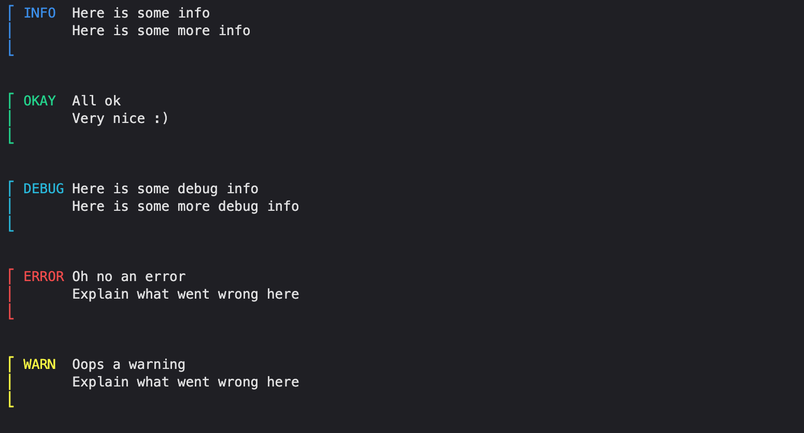
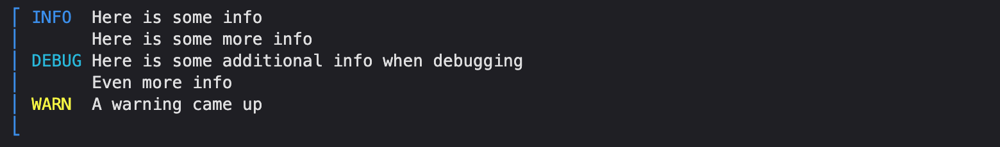
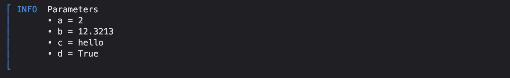

# FancyPrint

Working on high-performance clusters is ugly but it doesn't have to be! FancyPrint is a small package containing helpers to make terminal outputs just a little more fancy 💅.

## Chunks

The core concept of FancyPrint is the `FancyPrintContext`. Let's look at an example


```python
import fancyprint as fp

with fp.FancyPrintContext("My first context", fp.MessageType.INFO) as ctx:
    ctx.print("Hello world!")
```


As we can see, the two print statements "My first context" and "Hello world!" are visually grouped together into a chunk. In FancyPrint each chunk has an associated `MessageType` that represents what kind of information should be conveyed. There are a total of 5 different types

* `MessageType.INFO`
* `MessageType.OK`
* `MessageType.DEBUG`
* `MessageType.ERROR`
* `MessageType.WARNING`


```python
import fancyprint as fp

with fp.FancyPrintContext("Here is some info", fp.MessageType.INFO) as fpc:
    fpc.print("Here is some more info")

with fp.FancyPrintContext("All ok", fp.MessageType.OK) as fpc:
    fpc.print("Very nice :)")
    
with fp.FancyPrintContext("Here is some debug info", fp.MessageType.DEBUG) as fpc:
    fpc.print("Here is some more debug info")
    
with fp.FancyPrintContext("Oh no an error", fp.MessageType.ERROR) as fpc:
    fpc.print("Explain what went wrong here")
    
with fp.FancyPrintContext("Oops a warning", fp.MessageType.WARNING) as fpc:
    fpc.print("Explain what went wrong here")
```


    


## Single line chunks

Sometimes we just want to print a single-line status message. For this case FancyPrint provides the `print_single` method which produces the following output:


```python
fpc.print_single("This is a single-line warning", fp.MessageType.WARNING)
```


For convenience FancyPrint defines the following aliases 

| Alias            	|                                                 	|
|------------------	|-------------------------------------------------	|
| `info(message)`  	| `print_single(message, fp.MessageType.INFO)`    	|
| `ok(message)`    	| `print_single(message, fp.MessageType.OK)`      	|
| `error(message)` 	| `print_single(message, fp.MessageType.ERROR)`   	|
| `warn(message)`  	| `print_single(message, fp.MessageType.WARNING)` 	|
| `debug(message)` 	| `print_single(message, fp.MessageType.DEBUG)`   	|

## Different Message Types within the same chunk

Sometimes we need to print messages with a different status than the encapsulating chunk without giving up the visual grouping. This can be done by providing a `MessageType` when printing within a chunk.


```python
with fp.FancyPrintContext("Here is some info", fp.MessageType.INFO) as fpc:
    fpc.print("Here is some more info")
    fpc.print("Here is some additional info when debugging", fp.MessageType.DEBUG)
    fpc.print("Even more info")
    fpc.print("A warning came up", fp.MessageType.WARNING)
```



# Quality of life functions

FancyPrint contains a couple of quality of life functions that make printing common data structures a little fancier.

## Dictionaries

Dictionaries can be formatted using the `print_enum()` function


```python
params = {"a" : 2, "b": 12.3213, "c" : "hello", "d" : True}
fp.print_enum(params, fp.MessageType.INFO, "Parameters")
```



## Tables

The submodule `fancytables` contains method to format lists, arrays and data frames as tables.


```python
import numpy as np
from fancyprint.fancytables import FancyTable

epochs = np.arange(10)
loss = np.random.rand(10).cumsum()[::-1]
FancyTable(["epoch", "loss"], [5, 10]).print(epochs, loss)
```

    epoch |    loss   
    ==================
    0     | 6.25687424
    1     | 5.73194731
    2     | 4.92706871
    3     | 4.01176675
    4     | 3.32631038
    5     | 2.78111724
    6     | 1.92718965
    7     | 1.71882470
    8     | 1.36888238
    9     | 0.76762262


## Loss functions in ML

Tracking the change in the loss function per epoch is a common task in machine learning and the `FancyChangeTracker` provides an extremely simple way to output nicely formatted outputs.


```python
from fancytables import FancyChangeTracker
tracker = FancyChangeTracker("loss", quantities=["absdelta", "absreldelta"], idx=True)
for epoch in epochs:
    tracker.update(loss[epoch])
```

    idx | loss | absdelta | absreldelta
    ===================================
      0 | 5.84 | nan      | nan        
      1 | 5.23 | 0.609594 | 0.104296049
      2 | 4.89 | 0.337369 | 0.064441899
      3 | 4.86 | 0.037660 | 0.007689217
      4 | 4.15 | 0.709053 | 0.145889068
      5 | 3.22 | 0.927024 | 0.223316566
      6 | 2.31 | 0.904965 | 0.280683911
      7 | 1.75 | 0.563701 | 0.243060668
      8 | 0.89 | 0.858771 | 0.489195502
      9 | 0.30 | 0.594793 | 0.663309048

